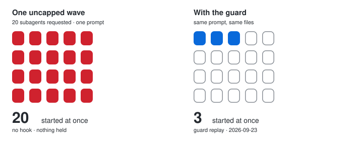

<picture>
  <source media="(prefers-color-scheme: dark)" srcset="docs/logo-dark.svg">
  
</picture>

# serio-focus

**An ADHD quality-of-life tool for Claude Code: less noise, more done.**

Every reply starts with the action and ends with one next step. 
Subagent floods capped · big reads trimmed · destructive commands held to the final state.

<!-- handoff-demo -->

<!-- /handoff-demo -->

[Start here](#start-here) · [What it does](#what-it-does) · [Proof](#proof) · [Method](docs/BENCHMARK.md) · [Contributing](CONTRIBUTING.md)

## Example

Claude Code can launch 20 subagents in one turn. A 5-hour window goes in seconds.

The hook caps each wave at 3 and queues the rest.

## Start here

1. `git clone https://github.com/serio-ngo/serio-focus.git && cd serio-focus`
   You should see `Cloning into 'serio-focus'`.
2. `npm run setup`
   You should see `Ready. Restart Claude Code so the session card loads.`
3. Restart Claude Code, then `npm run doctor`
   You should see every check answer `yes`.

Without a checkout: `/plugin marketplace add serio-ngo/serio-focus`, then `/plugin install serio-focus@serio-ngo` and restart.

## What it does

| Guard | Notes |
|---|---|
| Fan-out cap | `HANDOFF_MAX_PER_WAVE=3`, `HANDOFF_WAVE_MS=60000` — excess waits for the next wave. A workflow states `// AGENTS: 3`, or `// AGENTS: 3+1` for waves run one after another. |
| Read budget | A `Read` over 24 KB arrives trimmed; the same read in a shell is held instead; an unchanged file is never re-sent. |
| Dispatch budget | Every subagent names a tier; `HANDOFF_DENY_SUBAGENT_MODELS=opus,fable` never reviews. |
| Stall hold | Past `HANDOFF_STALL_HOLD=1200000` fresh tokens with no change to the repo tree, the main session's dispatch and web calls are held and subagents are told to return. Reads, shell and edits stay open; any repo change reopens. `0` disables. |
| Git lock | `git commit` and `git push` are held to the final state; the card lists the exact command. Recursive deletes and `clean -fdx` / `reset --hard` too. Reads, branches, stashes and merges run. `HANDOFF_GIT_WRITE=1` reopens commit and push. |
| Focus style | `output-styles/focus.md` ships forced for the plugin: action first, Done ≤5, one next step. |
| Session receipt | One line at Stop: tokens kept out and guard actions, plus tokens since the last repo change past `HANDOFF_STALL_WARN=500000`. Silent otherwise. |

Every guard blocks first and suggests second. No block is a refusal — each names the override above
or the command to run yourself, and the owner decides.

## Proof

Every case is labelled in `tooling/corpus/guard-corpus.jsonl` and re-scored on each run against four
comparators. Cost, limits and full method: [docs/BENCHMARK.md](docs/BENCHMARK.md).

[CONTRIBUTING.md](CONTRIBUTING.md) · [SECURITY.md](SECURITY.md) · [docs/BENCHMARK.md](docs/BENCHMARK.md) · [docs/MANIFEST.md](docs/MANIFEST.md) · [docs/CLAUDE_CODE_FACTS.md](docs/CLAUDE_CODE_FACTS.md) · [Apache-2.0](LICENSE) · Built by [Serio NGO](https://serio.org.pl)

